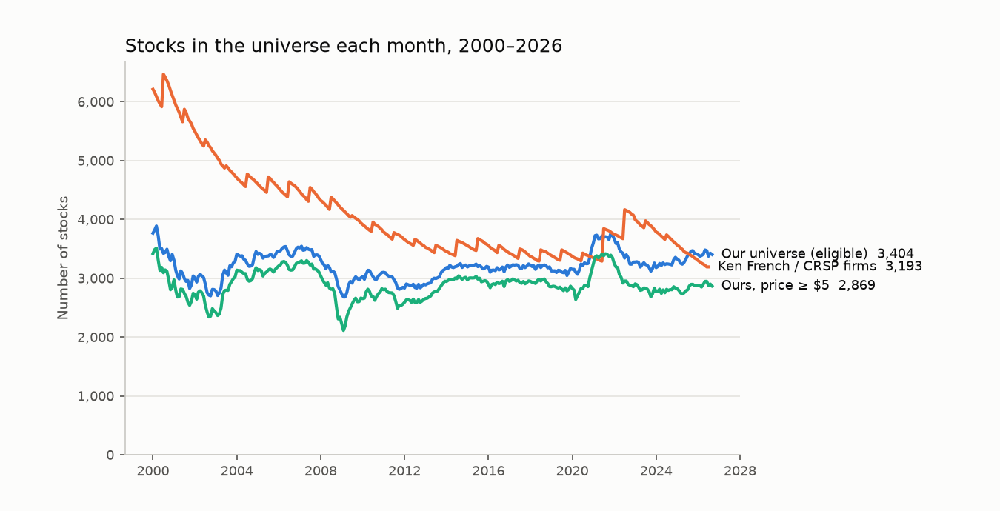

# Case study 3: eleven vendor-data problems found by a validation gate

**Summary.** Before any stock strategy was allowed to run, the data pipeline had to reproduce known academic numbers (the "V0" gate). The first run failed badly: the equal-weighted universe return correlated only 0.47 with the Ken French / CRSP benchmark, off by about 1% a month. It passed only after eleven data problems were found and fixed, each now a coded rule with a test.

## The gate (fixed before the first run)

| Check | Bar | Final result |
|---|---|---|
| Stocks per month | several thousand, plausible over time | 2,700–3,800 eligible |
| Equal-weighted universe vs French EW (CRSP) | corr > 0.95 | **0.984** (2000–2026), mean gap +0.03% a month |
| Value-weighted universe vs French market | reported | 0.996 |
| 12-2 momentum decile spread vs UMD | corr > 0.8 | **0.836** (French's own decile spread: 0.844 vs UMD) |
| Delisting rate | about 5–10% a year | 4.2%–9.1% |
| Known collapses present (Lehman, WaMu, GM, Sears, Frontier, Bed Bath & Beyond, SVB, Silvergate) | all | 8 of 8 |
| 20 random fundamentals: value and date correct | all | 20 of 20 values; acceptance times match the EDGAR header |

Report: [`../V0_REPORT.md`](../V0_REPORT.md). Chart: 

## The problems (vendor: survivorship-free daily prices, 50,879 US series)

1. **Filed under the last ticker.** Washington Mutual's NYSE history sat under its later OTC ticker; a download filtered by exchange would have dropped the bankruptcies. Listing periods now come from SEC Form 25 filings.
2. **Duplicates.** The same history under two codes (1,849 by company and prices; 868 more by identical returns, including re-domiciled companies with new SEC IDs).
3. **Ticker changes** start new series; they are chained and stitched with raw closes.
4. **Splices.** Old and new shares after a bankruptcy glued together (+144,000% in a day). Cut into two securities.
5. **Missed reverse splits.** A ×10 jump from a penny price with no split on file. Divided out when it matches a round ratio.
6. **Scale breaks.** A series jumping from $2,099 to $7. Falls that land above $1 are vendor errors; falls that end in pennies (Lehman) are real.
7. **Bad prints.** A $1,000,000 placeholder for weeks; two securities' prices alternating. Removed when they revert.
8. **Wrong market caps.** SEC share-count typos (317 trillion shares) and back-adjusted "raw" closes, checked against the 10-K public float, dollar turnover and total assets.
9. **Wrong company matches.** Overstock's price history filed under Bed Bath & Beyond's old ticker; old GM's series overlapping new GM's. The ticker is matched to a company only while it was in use.
10. **Time zones.** The SEC bulk submissions file labels acceptance times UTC but stores some in Eastern time (4–5 hour errors). Fundamentals use the statement data sets, checked against EDGAR headers.
11. **Foreign IPOs** entered through form 424B4 (one with a 227-billion share typo). The universe now requires 10-K/10-Q/S-1 filers and excludes 20-F/40-F.

## How they were found

Almost none were found by looking at the data directly. They were found by **comparing aggregates with an independent reference** and then drilling into the worst month:
- an equal-weighted mean off by 1% a month → a handful of returns above +1,000%;
- a value-weighted correlation of 0.65 → one stock carrying 27% of the index weight;
- a momentum loser leg 0.7% a month too low → one fake −99.6% month on a $428 bn fake market cap.

## Lessons

1. Validate the pipeline against known numbers before running any strategy.
2. Build checks that use independent sources (SEC float vs vendor price × shares).
3. Encode each fix as a rule with a test, so the next data refresh cannot reintroduce it.
